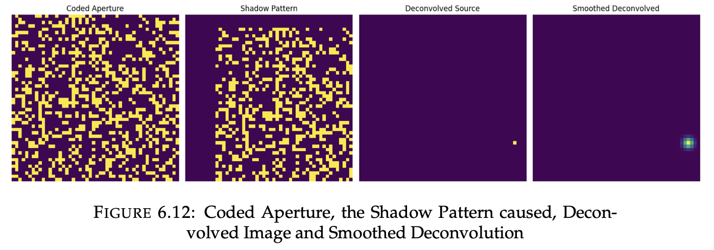

# Coded Aperture & Richardson-Lucy Image Restoration

Accurate image restoration of deep-sky objects is critical in astronomical imaging, where traditional methods often fail to resolve fine details due to system blur. This repository implements a framework combining **Coded Aperture Systems** and **Richardson-Lucy Deconvolution** to enhance image reconstruction fidelity and achieve precise localization of celestial objects.

---

## Project Overview

This project aims to overcome system blur in astronomical imaging through a two-step framework:
1. **Coded Aperture Imaging:** Capturing the source image via a specialized mask, resulting in a unique shadow pattern (convolved projection).
2. **Optimized Deconvolution:** Utilizing the Richardson-Lucy algorithm paired with a grid-search optimization strategy to determine exact angular displacements, maximizing reconstruction accuracy.

---

## Mathematical Framework

### Reconstruction Fidelity
To quantitatively evaluate the accuracy of the reconstructed image against the original source, we utilize a normalized **Fidelity Index ($F$)**:

$$F = \frac{\sum (O \cdot R)}{\sqrt{\sum O^2 \cdot \sum R^2}}$$

Where:
* $O$ = Original source image
* $R$ = Reconstructed image

---

## Results

Based on the core implementation for a Two-Dimensional Coded Aperture and Image Source, the framework achieved the following benchmarks:

* **Optimal Angular Displacement:** Determined to be **$(-1.67^\circ, -1.67^\circ)$** via grid search, pinpointing the exact source angle by maximizing the fidelity index.
* **High Reconstruction Fidelity:** Achieved an $F$-index of **$0.8834$**, proving high structural and intensity agreement between the ground truth and the restoration.
* **Profile Retention:** The Richardson-Lucy algorithm successfully extracted the source from its shadow pattern. While minor peripheral distortions exist, the core **Gaussian profile** of the celestial source is excellently preserved, validation its capacity to capture both intensity and angular data.

---

## Visual Workflow Result

The processing pipeline generally follows a 4-panel visual sequence:
1. **Mask Design:** The coded aperture geometry.
2. **Original Source:** The ground-truth celestial object (Gaussian profile).
3. **Shadow Pattern:** The angular displacement projections of the mask convolved with the source image.
4. **Deconvolved Source:** The final reconstructed output, showing strong shape and intensity alignment with the original source.

---
